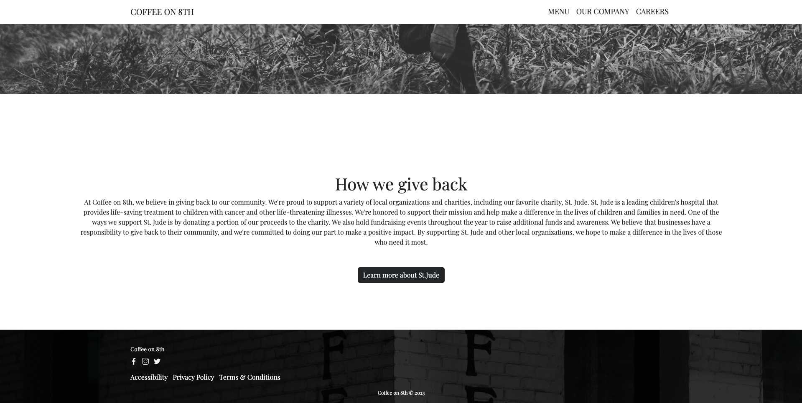

Coffee on 8th Laning Page

 

``HTML`` | ``CSS`` | ``Bootstrap`` | ``PHP`` | ``SQL`` 

 
OVERVIEW
 
 
Coffee on 8th is a website for a coffee shop built using HTML, CSS, Bootstrap, PHP, SQL, and MySQL. It features various functionalities including sign up and login pages, and a responsive design to ensure compatibility across different devices.
 
 
FEATURES
 
 
Sign Up and Login Pages: Implements user authentication functionality with sign up and login pages, allowing users to create accounts and access personalized features.
 
 
Database Integration: Utilizes MySQL and PHP for database management, storing user information securely and enabling dynamic content generation.
 
 
Responsive Design: Ensures that the website is accessible and user-friendly on various devices, including desktops, tablets, and smartphones.
 
 
Bootstrap Framework: Utilizes Bootstrap for front-end development, facilitating responsive layouts and streamlined design components.

[Live Demo](https://coffeeon8th.netlify.app/)

